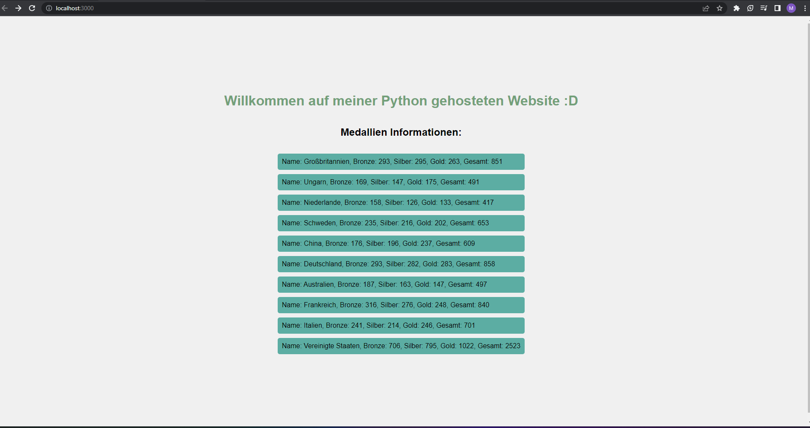

# TS-docker-prep

Dockerized Python backend und mongoDB.

## Ordnerstruktur

- `docker-prep`
    - `backend`: Enthält den Backend-Code für Ihr Projekt.
        - `templates`: Enthält die HTML-Vorlagen für die Webanwendung.
            - `index.html`: Die Hauptvorlage für die Webanwendung.
        - `app.py`: Der Hauptcode für das Backend der Anwendung.
        - `Dockerfile`: Die Dockerfile-Konfiguration für das Backend.
        - `requirements.txt`: Die erforderlichen Python-Abhängigkeiten für das Backend.
    - `data`: Enthält Daten und Skripte für das Projekt.
    - `data.json`: Daten für die Anwendung.
    - `Dockerfile`: Die Dockerfile-Konfiguration für die Datenverarbeitung.
    - `script.sh`: Ein Skript zur Verarbeitung der Daten.

- `docker-compose.yml`: Die Docker Compose-Konfigurationsdatei für das gesamte Projekt.

- `LICENCE`: Die Lizenzdatei für das Projekt (z. B. MIT-Lizenz).

- `preview.png`: Ein Screenshot der Anwendung.

## Installation

1. Klone das Repository: `git clone https://github.com/username/repository.git`
2. Navigiere in den Projektordner: `cd repository`
3. Starte die Anwendung: `docker-compose up`

## Author

- [Satisfraction](https://github.com/Satisfraction)

## Lizenz

Dieses Projekt ist unter der [MIT License](LICENSE) lizenziert.

